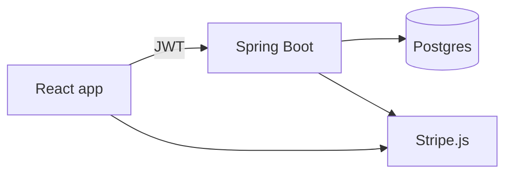

# Pianly

Learn piano in the browser — pick a song, follow the keys on screen, use your computer keyboard, a MIDI keyboard, or the mic. Free accounts get a taste of the catalog; [Pianly Pro](https://www.pianly.net/pricing) unlocks everything.

Try it: **[pianly.net](https://www.pianly.net)**

## How it's built

React + Vite on the front, Spring Boot + Postgres on the back. You sign up, log in, get a JWT; the API checks it on protected routes. Pro subscriptions go through Stripe (embedded checkout + webhooks); we store `pro` on your user row.



Worth knowing where things live:

- `frontend/src/pages/Playground/` — the actual practice screen
- `frontend/src/data/songCatalog.js` — songs + what's free vs Pro
- `backend/.../auth/` — register, login, tokens
- `backend/.../payment/` — checkout, portal, webhooks
- `dev/run.sh` / `dev/down.sh` — spin up both servers locally

Production today: frontend on Vercel, backend + DB on Railway, Stripe for billing.

## Run it locally

You need Node 20+, Java 21, and Postgres (defaults assume DB `pianly`, user/pass `postgres` unless you override).

```bash
./dev/run.sh    # frontend :5173, backend :8080
./dev/down.sh   # stop
```

Or the long way:

```bash
cd backend && cp .env.example .env && ./mvnw spring-boot:run
cd frontend && cp .env.example .env.local && npm install && npm run dev
```

Copy the `.env.example` files and fill in real values — don't commit `.env`.

**Backend:** `JWT_SECRET_KEY` (generate with `openssl rand -base64 64`), Stripe keys if you want billing, Postgres vars or `SPRING_DATASOURCE_URL`, `FRONTEND_URL` in prod for CORS.

**Frontend:** `VITE_API_BASE_URL` (point at your backend in prod; often empty locally), `VITE_STRIPE_PUBLISHABLE_KEY` if you want checkout to work.

For Stripe webhooks on your machine, the [Stripe CLI](https://stripe.com/docs/stripe-cli) forwarding to `http://localhost:8080/api/v1/payments/webhook` is the easiest path.

## Main API routes

- `POST /api/v1/auth/register` · `POST /api/v1/auth/authenticate` — account stuff
- `GET /api/v1/payments/status` — am I Pro?
- `POST /api/v1/payments/create-checkout-session` · portal + session-status — billing
- `POST /api/v1/payments/webhook` — Stripe → us (signature verified)

Secrets stay in env vars on Railway/Vercel (or your host), never in the repo.
